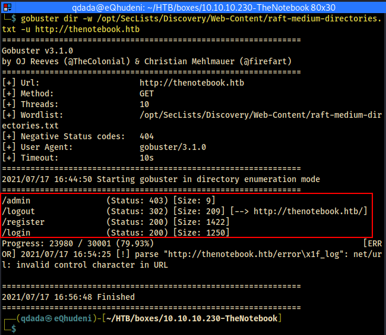

# web
## gobuster
```bash
gobuster dir -w /opt/SecLists/Discovery/Web-Content/raft-medium-directories.txt -u http://thenotebook.htb
```

````bash
└─$ gobuster dir -w /opt/SecLists/Discovery/Web-Content/raft-medium-directories.txt -u http://thenotebook.htb
===============================================================
Gobuster v3.1.0
by OJ Reeves (@TheColonial) & Christian Mehlmauer (@firefart)
===============================================================
[+] Url:                     http://thenotebook.htb
[+] Method:                  GET
[+] Threads:                 10
[+] Wordlist:                /opt/SecLists/Discovery/Web-Content/raft-medium-directories.txt
[+] Negative Status codes:   404
[+] User Agent:              gobuster/3.1.0
[+] Timeout:                 10s
===============================================================
2021/07/17 16:44:50 Starting gobuster in directory enumeration mode
===============================================================
/admin                (Status: 403) [Size: 9]
/logout               (Status: 302) [Size: 209] [--> http://thenotebook.htb/]
/register             (Status: 200) [Size: 1422]                             
/login                (Status: 200) [Size: 1250]                             
Progress: 23980 / 30001 (79.93%)                                            [ERROR] 2021/07/17 16:54:25 [!] parse "http://thenotebook.htb/error\x1f_log": net/url: invalid control character in URL
                                                                             
===============================================================
2021/07/17 16:56:48 Finished
===============================================================
````


- ffuf did not find vhosts

## web app
### account registration

- the app allows registration
- registered with qdada : secret123
- Jason Web Token visible.


