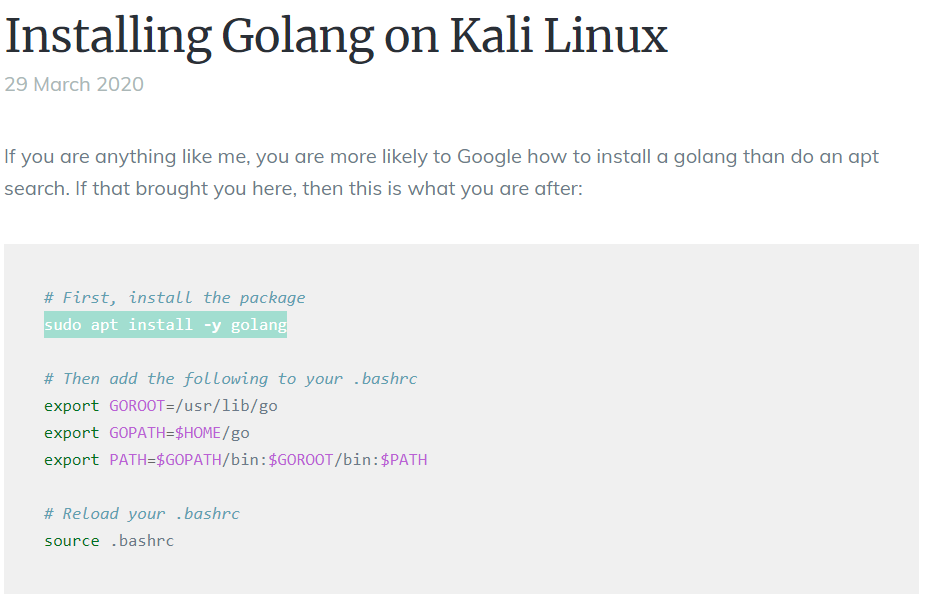

# root
````bash
sudo -l
Matching Defaults entries for noah on thenotebook:
    env_reset, mail_badpass,
    secure_path=/usr/local/sbin\:/usr/local/bin\:/usr/sbin\:/usr/bin\:/sbin\:/bin\:/snap/bin

User noah may run the following commands on thenotebook:
    (ALL) NOPASSWD: /usr/bin/docker exec -it webapp-dev01*
````
- a docker instance of the app webapp-dev01 can be started with  root privileges
- one can append that command with bash so that bash runs as root, inside the docker instance

## docker escape
- As Ipppsec explains ( https://youtu.be/S4FrlMTY0GY?t=2073 ), for think version of docker, there is a vulnerability that allows one to break into docker then escape it by overwriting bash on host
```bash
/usr/bin/docker -v
````
- reveals docker version 18.06.0-ce
- a docker escape POC by the researcher Nick Frichette exists (https://github.com/Frichetten/CVE-2019-5736-PoC).
- 

<hr>

### install go lang




- install go lang on Kali if not already installed.

<hr>

### modify the POC


````bash
go build main.go
````
- the POC is modified and then compiled


- main has been compiled and python web server is started so as to pull the binary from the victim machine.

<HR>

### exploit overview
	
- two shells into noah are launched
- each of the shell will run docker instances at two stages
- stage 1 runs the main binary which overwrites runc on the host with the reverse shell payload
- stage 2 starts the second docker instance, thereby running runc again, executing the reverse shell.

### exploit execution


<span class="boxedpoints">[1]</span> the docker instance is started with <span class="redunderline">/bin/bash</span>
<span class="boxedpoints">[2]</span> 3 commands are executed all at once
	- the compiled binary is downloaded from Kali
	- once downloaded the binary's flag is changed to be executable
	- finally the binary is executed
<span class="boxedpoints">[3]</span> On the second portal, the command to start a docker instance with <span class="redunderline">/bin/sh</span> is standing by until the line `Overwritten /bin/sh successfully` appears. 
<span class="boxedpoints">[4]</span> Immediatley as the line in [3] appears, the docker instance is started with <span class="redunderline">/bin/sh</span>

### exploit execution animation (righ-click view image for clear view)

