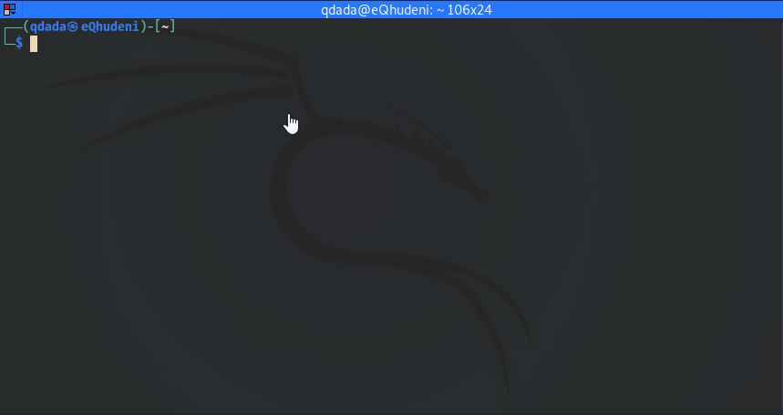
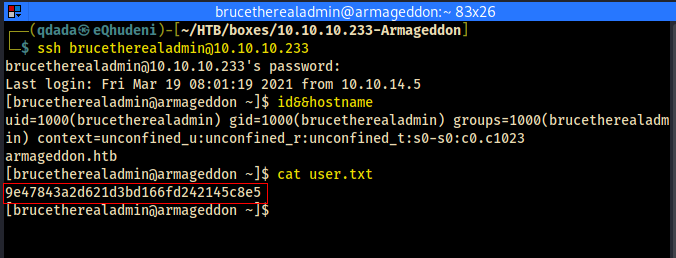

# user


- searchsploit suggests a specific Metasploit exploit



- Metasploit establishes a session


- Stabilizing shell <span style="background-color:red;color:fff;font-weight:bold;">fails</span>


````php
$databases = array (
  'default' => 
  array (
    'default' => 
    array (
      'database' => 'drupal',
      'username' => 'drupaluser',
      'password' => 'CQHEy@9M*m23gBVj',
      'host' => 'localhost',
      'port' => '',
      'driver' => 'mysql',
      'prefix' => '',
    ),
  ),
);
````
- enumeration drupal site database connection settings reveals database credentials


- credentials were use to retrieve a hash
````
$S$DgL2gjv6ZtxBo6CdqZEyJuBphBmrCqIV6W97.oOsUf1xAhaadURt
````


````bash
john thehash --show
?:booboo

1 password hash cracked, 0 left
````

- the password matching the hash was in the wordilst *rockyou.txt* (````booboo````)


- The only account on the machine that has access to an interactive shell is ``brucetherealadmin``



- credendtials ````brucetherealadmin:booboo```` are able to login