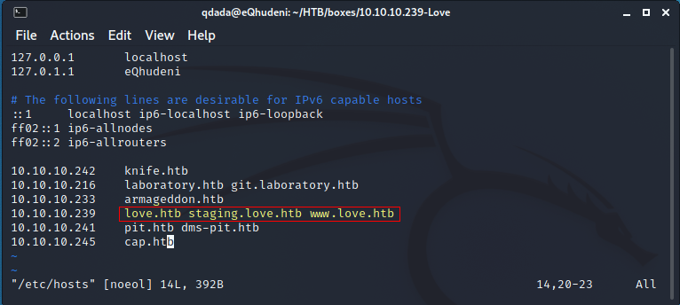
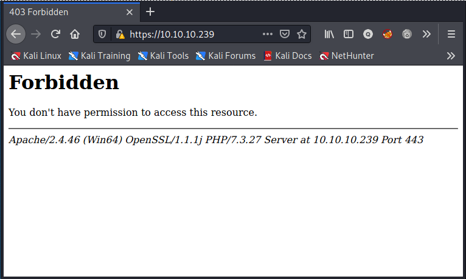
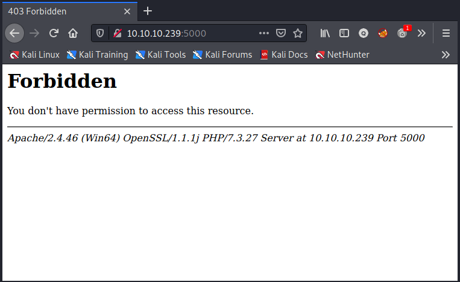
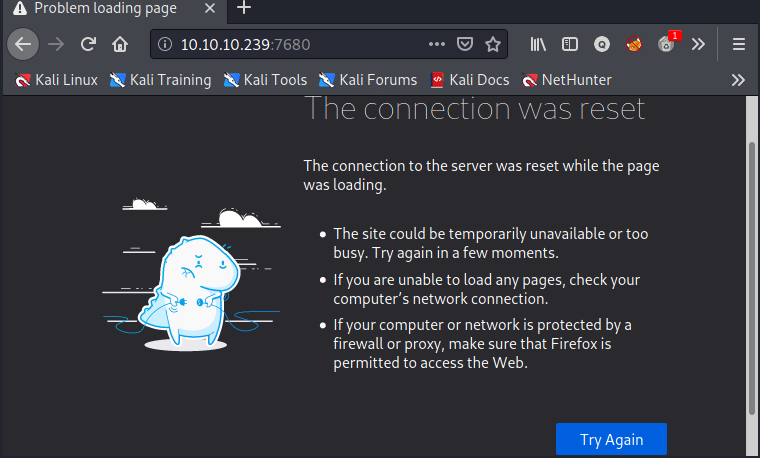
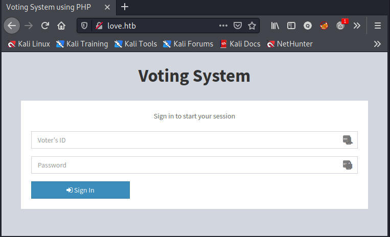
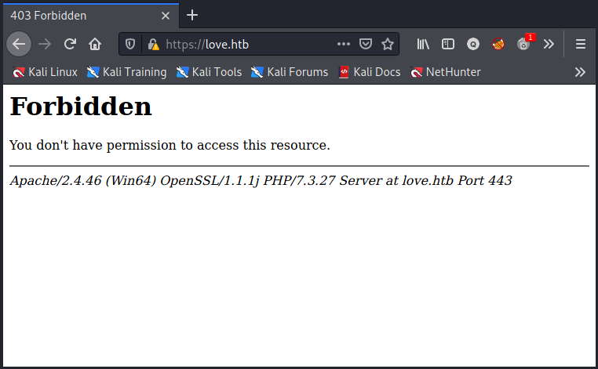
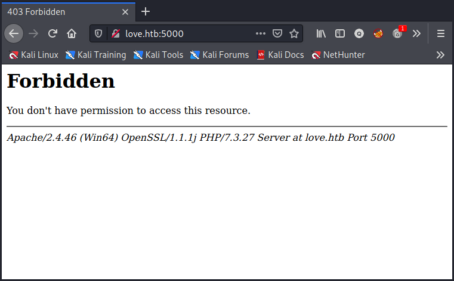
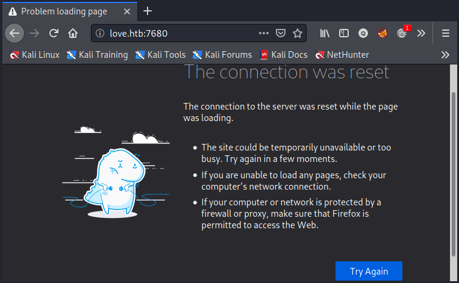
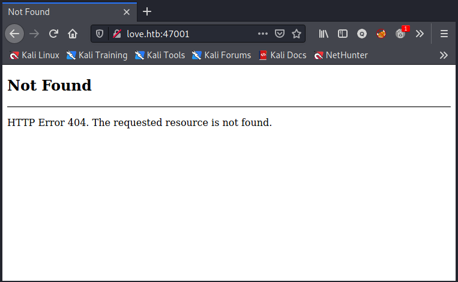

# web

## /etc/hosts

````bash
139/tcp   open  netbios-ssn  syn-ack Microsoft Windows netbios-ssn
443/tcp   open  ssl/http     syn-ack Apache httpd 2.4.46 (OpenSSL/1.1.1j PHP/7.3.27)
|_http-server-header: Apache/2.4.46 (Win64) OpenSSL/1.1.1j PHP/7.3.27
|_http-title: 403 Forbidden
| ssl-cert: Subject: commonName=staging.love.htb/organizationName=ValentineCorp/stateOrProvinceName=m/countryName=in/organizationalUnitName=love.htb/emailAddress=roy@love.htb/localityName=norway
| Issuer: commonName=staging.love.htb/organizationName=ValentineCorp/stateOrProvinceName=m/countryName=in/organizationalUnitName=love.htb/emailAddress=roy@love.htb/localityName=norway
| Public Key type: rsa
| Public Key bits: 2048


49669/tcp open  msrpc        syn-ack Microsoft Windows RPC
49670/tcp open  msrpc        syn-ack Microsoft Windows RPC
1 service unrecognized despite returning data. If you know the service/version, please submit the following fingerprint at https://nmap.org/cgi-bin/submit.cgi?new-service :
SF-Port3306-TCP:V=7.91%I=7%D=6/13%Time=60C62A12%P=x86_64-pc-linux-gnu%r(NU
SF:LL,4A,"F\0\0\x01\xffj\x04Host\x20'10\.10\.14\.10'\x20is\x20not\x20allow
SF:ed\x20to\x20connect\x20to\x20this\x20MariaDB\x20server")%r(Help,4A,"F\0
SF:\0\x01\xffj\x04Host\x20'10\.10\.14\.10'\x20is\x20not\x20allowed\x20to\x
SF:20connect\x20to\x20this\x20MariaDB\x20server");
Service Info: Hosts: www.example.com, LOVE, www.love.htb; OS: Windows; CPE: cpe:/o:microsoft:windows


````

- from `commonName` an entry for  staging.love.htb
- from  `Service Info:`  entries for <span class="myYellowHighlight"> www.example.com </span>, <span class="myYellowHighlight"> LOVE </span>,<span class="myYellowHighlight"> www.love.htb </span>


 ## open ports
 - <span class="myYellowHighlight">80/tcp    open  http</span> syn-ack Apache httpd 2.4.46 ((Win64) OpenSSL/1.1.1j PHP/7.3.27)

 - <span class="myYellowHighlight">443/tcp   open  ssl/http</span> syn-ack Apache httpd 2.4.46 (OpenSSL/1.1.1j PHP/7.3.27)

 - <span class="myYellowHighlight">5000/tcp  open  http</span> syn-ack Apache httpd 2.4.46 (OpenSSL/1.1.1j PHP/7.3.27)

 - <span class="myYellowHighlight">7680/tcp  open</span> pando-pub?   syn-ack

 - <span class="myYellowHighlight">47001/tcp open  http</span> syn-ack Microsoft HTTPAPI httpd 2.0 (SSDP/UPnP)

## default vhost 10.10.10.239

### port 80
- page accessible


### port 443
- no page accessible


### port 5000
- no page accessible


### port 7680
- no service accessible


## vhost love.htb
### port 80
- page accessible


### port 443
- page not accessible


### port 5000
- page not accessible


### port 7680
- service not accessible


### port 47001
- service not accessible


## vhost staging.love.htb
### <span class="myYellowHighlight">port 80</span>
- page accessible


