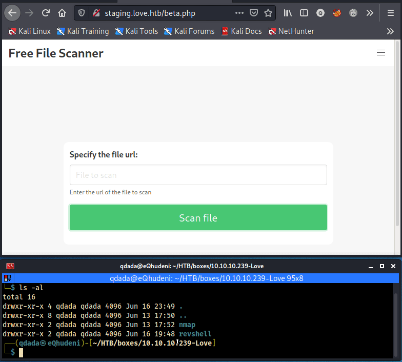
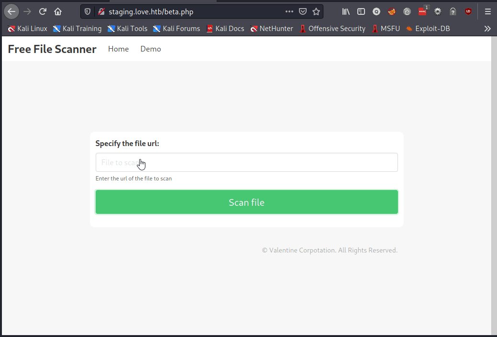

# user

## RCE

- RCE is possible but could not execute php windows reverse shell
- Could the page be used for SSRF ?

## SSRF
- trying SSRF to reach ports 80, 443, 5000, 7680 and 47001 as before

#### port 80

- http://127.0.0.1:80 renders successfully

### port 5000

- http://127.0.0.1:5000 renders successfully
- credits discovered admin:@LoveIsInTheAir!!!!
- nothing was found on remaining ports 7680 and 47001

### reverse shell

- [[15 - ffuf]] had found admin folder 
- php reverse shell needed can be found http://https://github.com/ivan-sincek/php-reverse-shell/blob/master/src/php_reverse_shell.php or [[25 - php windows reverse shell]]
- logon to that url to create a user that gives reverse shell

